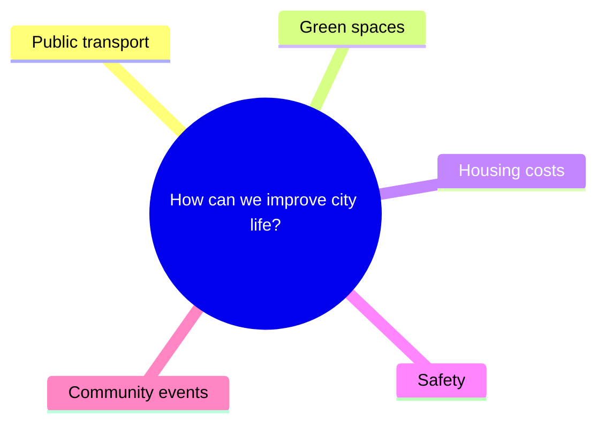

# Implementation Plan: Exam Content, Grading & Visual Generation

## Overview

Three features for Cambridge Speaking Exam practice app:
1. **Question Creation & DB Insertion** - LLM-generated exam content
2. **Response Evaluation & Grading** - LLM-as-judge + pronunciation scoring
3. **Collaborative Task Visuals** - Mermaid prompt diagrams + photo sets where required

---

## Architecture

```
Client (Expo/RN)
    │
    ├─► examContentApi.ts ──► Supabase DB (fetch questions)
    ├─► voiceApi.ts ────────► Edge Functions
    │       ├─► exam-grade (grading)
    │       ├─► content-generate (question creation)
    │       └─► generate-part2-images (photo sets)
    │
    └─► useConversationalAI ──► ElevenLabs (Collaborative Task only)
```

---

## Speaking Exam Format by Level (Cambridge)

**B2 First (Speaking = 14 minutes per pair / 20 minutes for 3 candidates)**  
Part 1: Interview (about 2 minutes).  
Part 2: Long turn with photos; 1 minute per candidate + ~30 sec partner response (roles swap).  
Part 3: Collaborative task with written prompts; 2-minute discussion + 1-minute decision.  
Part 4: Discussion on Part 3 topic (about 4 minutes).

**C1 Advanced (Speaking = 15 minutes per pair / 23 minutes for 3 candidates)**  
Part 1: Interview (about 2 minutes).  
Part 2: Long turn with 3 photos; 1 minute per candidate + ~30 sec partner response (roles swap).  
Part 3: Collaborative task; 2-minute discussion + 1-minute decision.  
Part 4: Discussion on Part 3 topic (about 5 minutes).

**C2 Proficiency (Speaking = 16 minutes per pair / 24 minutes for 3 candidates)**  
Part 1: Interview (about 2 minutes).  
Part 2: Collaborative task with pictures; reaction question + joint decision (about 4 minutes).  
Part 3: Long turn + discussion based on prompt card (about 10 minutes total).

---

## Feature 1: Question Creation & DB Insertion

### Edge Function: `content-generate`

**Location:** `supabase/functions/content-generate/index.ts`

**API:**
```typescript
POST /functions/v1/content-generate
{
  level: 'B2' | 'C1' | 'C2',
  contentType: 'interview' | 'discussion' | 'long_turn_photos' | 'collaborative_task' | 'c2_prompt_card',
  topic: string,
  count: number
}
// Returns: { contentIds: string[] }
```

**Implementation:**
- Use GPT-4o-mini with Cambridge examiner system prompt
- Insert with `is_active: false` for review before use
- Generate for appropriate table based on content type:
  - `interview` → `exam_questions` (`part = 'part1'`)
  - `discussion` → `exam_questions` (`part = 'part4'`)
  - `long_turn_photos` → `exam_part2_content` (B2/C1 Part 2)
  - `collaborative_task` → `exam_part3_content` (B2/C1 Part 3, C2 Part 2)
  - `c2_prompt_card` → `exam_c2_prompt_cards` (C2 Part 3 long turn)

**LLM Output Schemas (Structured JSON)**
```json
// interview / discussion
{
  "topic": "Travel",
  "question_text": "Do you prefer traveling alone or with friends?",
  "follow_up_questions": ["Why?", "Has this changed over time?"]
}

// long_turn_photos (B2/C1 Part 2)
{
  "topic": "Work and Study",
  "prompt_text": "Compare these photos and say what the people are learning and why.",
  "follow_up_question": "Which person seems to be enjoying it more?",
  "scenarios": ["Student in a science lab", "Adult learning online at home"]
}

// collaborative_task (B2/C1 Part 3, C2 Part 2)
{
  "topic": "City Life",
  "discussion_prompt": "How can a city improve quality of life?",
  "options": ["Public transport", "Green spaces", "Safety", "Housing", "Community events"],
  "decision_prompt": "Now decide which two are most important.",
  "diagram_mermaid": "mindmap\\n  root((How can a city improve quality of life?))\\n    Public transport\\n    Green spaces\\n    Safety\\n    Housing\\n    Community events"
}

// c2_prompt_card (C2 Part 3 long turn)
{
  "topic": "Technology and Society",
  "prompt_text": "Talk about the impact of AI on employment and education.",
  "bullet_points": ["Benefits to productivity", "Need for reskilling", "Ethical concerns"],
  "follow_up_question": "What long‑term effects do you foresee?"
}
```

**Audio Generation:**
- Lazy TTS via ElevenLabs when question first used
- Cache in Supabase Storage bucket `exam-content`
- Update `audio_url` field after generation

**Schema Additions (C2 Part 3 Prompt Cards):**
```sql
CREATE TABLE exam_c2_prompt_cards (
  id UUID PRIMARY KEY DEFAULT gen_random_uuid(),
  level TEXT NOT NULL CHECK (level = 'C2'),
  topic TEXT NOT NULL,
  prompt_text TEXT NOT NULL,          -- Long turn task card text
  bullet_points TEXT[],               -- Optional support ideas
  follow_up_question TEXT NOT NULL,   -- Interlocutor follow-up
  difficulty INTEGER DEFAULT 2,
  usage_count INTEGER DEFAULT 0,
  is_active BOOLEAN DEFAULT true,
  created_at TIMESTAMPTZ DEFAULT NOW(),
  audio_url TEXT,
  audio_generated_at TIMESTAMPTZ
);
```

---

## Feature 2: Response Evaluation & Grading

### Edge Function: `exam-grade`

**Location:** `supabase/functions/exam-grade/index.ts`

**API:**
```typescript
POST /functions/v1/exam-grade
{
  sessionId: string,
  level: 'B2' | 'C1' | 'C2',
  partResults: [{
    part: ExamPart,
    userTranscript: string,
    examinerQuestions: string[],
    durationSeconds: number,
    sttWords?: Array<{ word: string; confidence: number }>
  }]
}

// Returns:
{
  overallScore: number,      // Cambridge scale 140-230
  grade: 'Fail' | 'C' | 'B' | 'A',
  scores: ExamScores,        // 6 criteria (5 analytic + global), 0-5 each
  feedback: ExamFeedback,    // strengths, improvements, errors
  partResults: PartResult[]
}
```

### Scoring Approach (Aligned to Cambridge Criteria)

**Assessment criteria used by Cambridge Speaking examiners:**
- B2 First: Grammar and Vocabulary, Discourse Management, Pronunciation, Interactive Communication + Global Achievement.
- C1 Advanced: Grammatical Resource, Lexical Resource, Discourse Management, Pronunciation, Interactive Communication + Global Achievement.
- C2 Proficiency: Grammatical Resource, Lexical Resource, Discourse Management, Pronunciation, Interactive Communication + Global Achievement.

**LLM Grading (GPT-4o-mini):**
- B2: Grammar & Vocabulary (0-5) combined to match the official scale.
- C1/C2: Grammatical Resource (0-5) and Lexical Resource (0-5) scored separately.
- Discourse Management (0-5), Pronunciation (0-5), Interactive Communication (0-5).
- Global Achievement (0-5) scored as the interlocutor-style overall impression.
- **Important:** Score **only the user’s utterances**. Partner/agent lines are included only to assess interaction quality.

**Pronunciation (STT-based, Assistive Signal):**
- Use word confidence from ElevenLabs STT as a secondary signal, not the sole pronunciation score.
- Thresholds can still guide feedback highlights, but LLM should own the rubric-aligned score.
- Clamp any formulaic scores to [0, 5] if used at all.

**Cambridge Scale Mapping:**
```
B2: 140-190 (pass: 160, B: 173, A: 180)
C1: 160-210 (pass: 180, B: 193, A: 200)
C2: 180-230 (pass: 200, B: 213, A: 220)
```

### Feedback Generation

LLM generates:
- Summary paragraph
- 3-5 strengths
- 3-5 improvements
- Grammar errors with corrections
- Vocabulary suggestions (used → better alternative)

---

## Feature 3: Long Turn & Collaborative Task Visuals

### Long Turn Photos (B2/C1 Part 2 + C2 Part 2 Reaction)

Cambridge uses photographs of people in comparable situations.

**Edge Function: `generate-part2-images`** (photo set generator)

**Location:** `supabase/functions/generate-part2-images/index.ts`

**API:**
```typescript
POST /functions/v1/generate-part2-images
{
  contentId: string,
  topic: string,
  scenarios: string[],  // 2-3 scene descriptions
  level: ExamLevel,
  use: 'long_turn' | 'c2_reaction'
}
// Returns: { imageUrls: string[] }
```

**Implementation:**
- DALL-E 3 with photorealistic style prompt
- Generate 2 photos (B2) or 3 photos (C1) showing related but different scenarios
- For C2 Part 2 reaction: generate 2 photos that support a brief reaction question + decision prompt
- Prompt template: "Photorealistic image of [person] [action] in [setting]. Natural lighting, candid style, suitable for language exam."
- Store in Supabase Storage: `exam-content/part2/{level}/{id}-{n}.png`
- Update `image_urls[]` in `exam_part2_content`

### Collaborative Task Diagrams (B2/C1 Part 3)

Cambridge Part 3 uses mind-map style diagrams - central question with 5 options.

**Approach:** Store as Mermaid syntax, render client-side (no DALL-E needed)
- Generate Mermaid mindmap syntax during content creation
- Store in new `diagram_mermaid` column on `exam_part3_content`
- Client renders with `react-native-mermaid` or WebView
- **Pass raw Mermaid syntax to ElevenLabs agent** as text context

**Mermaid Format:**


**Schema Update:**
```sql
ALTER TABLE exam_part3_content ADD COLUMN diagram_mermaid TEXT;
```

**Content Generation:** LLM generates both `options[]` and `diagram_mermaid` together

**ElevenLabs Context:** Pass diagram as `dynamicVariables.diagramText`:
```typescript
conversation.startSession({
  agentId: COLLAB_AGENT_IDS[level],
  dynamicVariables: {
    taskPrompt: content.discussion_prompt,
    diagramText: content.diagram_mermaid,  // Raw mermaid syntax
    options: JSON.stringify(content.options),
  }
})
```

Agent prompt references the diagram structure so it knows the options without needing vision.

### Passing to ElevenLabs Agent

In `useConversationalAI.ts`:
```typescript
conversation.startSession({
  agentId: COLLAB_AGENT_IDS[level],
  dynamicVariables: {
    examLevel: level,
    taskType: 'collaborative',
    taskPrompt: discussionPrompt,
    diagramText: mermaidDiagramText,
    options: JSON.stringify(options),
    photoUrls: JSON.stringify(photoUrls ?? []),  // C2 Part 2 reaction photos
  }
})
```

---

## Storage Bucket Setup

**Migration:**
```sql
INSERT INTO storage.buckets (id, name, public)
VALUES ('exam-content', 'exam-content', true);

-- Public read, service-role write
CREATE POLICY "Public read" ON storage.objects
  FOR SELECT USING (bucket_id = 'exam-content');
```

---

## Files to Create/Modify

### New Files
```
supabase/functions/
  _shared/
    cors.ts
    supabase.ts
    openai.ts
    cambridge-prompts.ts
  exam-grade/index.ts
  content-generate/index.ts
  generate-part2-images/index.ts
```

### Modify
- `src/services/api/voiceApi.ts` - Wire up gradeExam() call
- `src/services/api/examContentApi.ts` - Fetch collaborative task + C2 prompt cards
- `src/features/voice/hooks/useConversationalAI.ts` - Pass visual context
- `app/exam/session/[id].tsx` - Collect transcripts for grading
- Results screen - Display real grades from DB

---

## Implementation Priority

### Phase 1: Grading (Core Value)
1. `exam-grade` edge function
2. Wire transcript collection in exam session
3. Call grading API on session complete
4. Display results from DB

### Phase 2: Content Generation
1. `content-generate` edge function
2. Seeding script for initial content
3. Audio caching for examiner prompts
4. C2 prompt card generation and seeding

### Phase 3: Long Turn & Collaborative Visuals
1. Storage bucket setup
2. `generate-part2-images` edge function (DALL-E 3)
3. Part 2 UI with photo display + comparison task
4. Add `diagram_mermaid` column to `exam_part3_content`
5. Mermaid renderer component for Part 3
6. Pass Mermaid syntax to ElevenLabs agent context

---

## Cost Estimates

| Operation | Cost |
|-----------|------|
| GPT-4o-mini grading (per exam) | ~$0.003 |
| GPT-4o-mini content gen (per item) | ~$0.001 |
| DALL-E 3 Part 2 photos (per set of 2-3) | $0.08-0.12 |
| ElevenLabs TTS (per question) | ~$0.01 |

**Optimization:**
- Cache all generated audio/images
- Batch content generation offline
- Use GPT-4o-mini (not GPT-4o)

---

## Verification

1. **Grading:** Complete exam session → verify scores saved to `exam_sessions` and `exam_part_results`
2. **Content:** Call content-generate → verify rows in DB with `is_active: false`
3. **Images:** Call generate-part2-images → verify images in Storage and URLs in DB
4. **E2E:** Run full collaborative task with diagram/photos → verify visuals display and conversation flows
